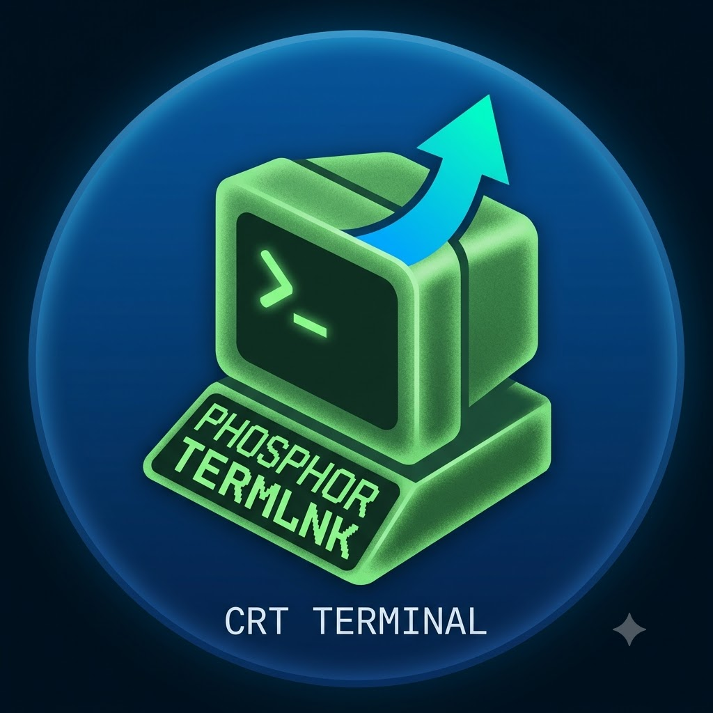

# Phosphor

**A local-first terminal with first-class AI — bring your own model, glowing since the VT100.**

<i>Based on <a href="https://github.com/warpdotdev/warp">Warp</a> (via <a href="https://github.com/zerx-lab/zap">Zap</a> / OpenWarp); evolving independently as its own project.</i>

> [!NOTE]
> **This is a personal project, mostly for fun and tinkering.** It's a playground
> for poking at Phosphor's BYOP (bring-your-own-provider) AI stack — prompt rendering,
> caching behavior, and provider plumbing — not a polished product. Things here
> are experimental and may change, break, or get thrown away. If you want the real
> thing, go upstream: [zerx-lab/zap](https://github.com/zerx-lab/zap). Everything
> below the upstream overview is what this fork has been messing with.
>
> Most of it is being tested against **FastFlowLM (FLM)** as a local BYOP
> endpoint, and several of the changes below exist specifically to play nicer
> with it — especially the prompt-cache / environment-context work, which is
> tuned for FLM's text-only partial-prefill (KV-cache) behavior.

Phosphor is an open, local-first terminal with first-class AI and agent support. Plug in any AI provider, bring in any CLI agent, manage SSH hosts inside the terminal — with keys, history and agent state staying on your machine by default.

## What Phosphor adds over upstream Warp

- **No mandatory cloud** — no account, login, Drive sync or cloud agent history required.
- **BYOP AI providers** — any OpenAI-compatible endpoint, plus native OpenAI / Anthropic / Gemini / DeepSeek / Ollama protocols, **and Google Vertex AI** (Gemini + Claude, authenticated through `gcloud` — no static key). Keys stay local.
- **Third-party CLI agents** — DeepSeek-TUI / Codex CLI / Claude Code / Google Antigravity (`agy`) wired into Blocks and the notification center.
- **Built-in SSH host manager** — manage hosts, configs and sessions inside the terminal, with tmux integration.
- **Editable system prompts** — minijinja templates rendered on the client.
- **Rendering fixes** — tuned Markdown pipeline; CJK soft-wrap caret and bold subpixel fixes.
- **Localized UI** — English / Simplified Chinese / Japanese out of the box, community-extensible.
- **Privacy defaults** — Cloud Agent / Computer Use / Referral / telemetry off by default.

## What this fork is playing with

All experimental, spread across feature branches. Roughly in order of how much
fun they were:

### Google Vertex AI (BYOP)
- **First-class Vertex AI provider** — pick "Vertex AI" as a provider type, enter
  your GCP **project** + **location** (and optionally a service-account email to
  impersonate), and add models like `gemini-2.5-flash` or `claude-sonnet-4-6`.
  The publisher (Gemini vs. Claude) is routed by model name automatically.
- **No static key** — Vertex uses short-lived OAuth2 bearer tokens, minted via
  the `gcloud` CLI (Application Default Credentials / the active account / SA
  impersonation) and cached in-process. Nothing to paste, nothing stored.
- Reuses the whole BYOP path — model picker, reasoning tiers, attachment caps —
  dispatched by model family. Includes a fix so streaming Claude on Vertex uses
  `:streamRawPredict` (Google's streaming method) rather than the unary endpoint.

### Prompts & providers
_Same FastFlowLM motivation as above, from the other direction: small models
served by FLM have tight context windows, and a bloated built-in system prompt
eats budget the actual conversation needs. Being able to hot-swap a leaner prompt
per model — live, without a rebuild — is the whole point here._
- **Per-profile, per-prompt system prompt overrides.** Every prompt slot in a
  profile can be set to **Auto** (pick a built-in by model family), a specific
  **built-in** family (`default` / `anthropic` / `lean` / `gpt` / `beast` /
  `codex` / `gemini` / `kimi` / `trinity` / `local` / `troubleshooting`), or a
  **custom file**. This
  covers the agent slots (base / coding / full-terminal-use / computer-use) and
  the auxiliary prompts (title generation, prompt suggestions, input completion,
  relevant files, workflow metadata, next command) — each picked independently in
  the profile editor's new **System Prompts** section.
- **Custom prompt files, hot-loaded.** Drop `.j2` / `.md` files into a `custom/`
  folder under your prompt template directory and they show up in every picker.
  They render through the same minijinja env as the built-ins (so
  `` still works) and are re-read live — no rebuild.
  Every override degrades gracefully (bad name, missing file, `..` traversal,
  syntax error → falls back to the built-in / auto pick).
- **Active-AI prompts folded into the hot-reload env.** The command-suggestion /
  input-completion / relevant-files / next-command / workflow-metadata templates
  used to be baked into a separate environment; they now hot-reload from the
  prompt directory like everything else.
- **`lean.j2`** — a trimmed agent system prompt to A/B against the verbose
  default, for exactly this: keeping the system prompt small enough that a
  small FLM model doesn't blow its context window before the conversation starts.
- **`troubleshooting.j2`** — a built-in example of a task-focused prompt: a
  diagnose-and-fix agent (observe the failure, one hypothesis at a time, change
  one thing, verify). Pair it with a "Troubleshooting" profile. It's opt-in per
  slot, never auto-picked by model family — a template to copy and riff on.
- **Tool-list dedup** — when structured tools are sent, the redundant
  `# Available Tools` text block is suppressed to save prompt tokens.

### BYOP wire inspector
- A **live capture window** for outbound/inbound LLM traffic: the exact system
  prompt, structured tools, the environment block, one-shots (title gen, active
  AI), and streamed responses. Filterable, pausable, copyable — opened from the
  left panel header. Handy for seeing what actually goes over the wire.

### Prompt-cache & environment-context stability
_Mostly driven by testing against FastFlowLM (FLM): it partial-prefills a stable
prefix, so anything volatile near the front of the prompt tanks the cache. Note
this assumes a **text-only** FLM model — VL/MoE engines that can't partial-prefill
don't benefit from the tail-block design._
- Volatile environment context moved **out of the system prompt into a tail
  block** (and appended as a standalone message) so upstream KV-cache breakpoints
  stay stable instead of being invalidated every turn.
- Environment context is **frozen/sticky per conversation** rather than refilled
  from shifting block metadata, so replays stop drifting.
- Tolerate null optional tool args; resolve tool-call ownership so assistant text
  can't orphan results.

### Terminal UI (TUI)
- **`zap-tui-oss` — a keyboard-driven terminal frontend**, ported from upstream
  Warp's `warp_tui` crate and rewired onto the BYOP stack (no cloud
  orchestration). It shares the GUI's app identity, so your models, config and
  providers load unchanged; it boots interactive with shell/path Tab-completion
  and the full non-cloud slash-command set (`/model`, `/profile`, `/prompts`,
  `/init`, `/compact-and`, `/queue`, `/fork`, `/fork-and-compact`, `/fork-from`,
  `/rewind` with file-revert, …). Cloud-only surfaces (codebase search, cloud
  conversation history, credits/usage) are intentionally dropped for BYOP.
- Build/run it with `cargo run -p warp_tui` (the crate is a non-default
  workspace member; the GUI build is unaffected). Agent runs go through the same
  BYOP path as the GUI (`chat_stream` / `oneshot` / the prompt-override system).

### Odds and ends
- **Title-generation language fix** (this branch's namesake) — stop Chinese-biased
  few-shot examples leaking into tab titles.
- **English-only** BYOP tool schemas and skill wrapper.
- **Logging** — the GUI always logs to a file now, with a `ZAP_LOG_STDOUT` escape
  hatch for stdout.
- **Perf** — reuse HTTP clients, unblock async DNS, trim webfetch/history
  overhead, cap `file_glob` results and back off failed retries.

## Migrating from Zap, OpenWarp, or Warp

If you used this project under an earlier name (**Zap**, or originally
**OpenWarp**), or are coming from upstream **Warp**, see
[docs/migrate-from-warp.md](docs/migrate-from-warp.md) to bring your settings
across. Note: on-disk config, secrets and data still live under the `zap` app id
for now, so existing installs keep working unchanged — the storage rename is
intentionally deferred (only the branding has changed so far).

## Roadmap

**There is no separate roadmap document.** Current work lives in
[`TODO.md`](TODO.md); current position lives in [`docs/STATE.md`](docs/STATE.md),
which is generated.

Two former roadmaps are accounted for, so nobody hunts for them:

- `docs/roadmap.md` was **Zap's** roadmap with the name find-replaced during the
  2026-07-25 rebrand. It described a direction this fork has not taken — a hosted
  agent runtime, shared identity across surfaces, shareable session links — much
  of which has since been explicitly declined here. **Removed 2026-08-11.**
- [`specs/ROADMAP.md`](specs/ROADMAP.md) was the 2026-08-02 tier-migration plan —
  an **earlier form of `TODO.md`**, kept for its history. Superseded; do not plan
  from it.

## Repository map — what each document is for

This fork carries a lot of process documentation, because it is tracking a
moving upstream and most of it exists to stop a wrong answer being re-derived.
Start here.

**Read before doing parity work** — `CLAUDE.md` is the index and says *why* each
of these exists, which matters more than what it contains.

| file | what it is for |
|---|---|
| **[`docs/STATE.md`](docs/STATE.md)** | **Where the project is right now** — parity, guard status, open work, and whether the tree has actually been verified. **Generated by `script/state`; never edit it.** Read this first. |
| [`CLAUDE.md`](CLAUDE.md) | The required-reading index. Each row says why that document exists. |
| [`AGENTS.md`](AGENTS.md) | Working rules. §5.6 never weaken a test to go green, §5.10 no silent regressions, §5.11 every defect gets an issue. |
| [`ORACLE.md`](ORACLE.md) | The pin. Parity is measured against Warp `02b53fcd8`, **never `warp/master`** — master moves 50-80 tests/day, so measuring against it produces a gap that never shrinks. |
| [`DECLINED.md`](DECLINED.md) | Deliberate non-parity. What is absent **on purpose**, with machine-checkable markers so a decision cannot be silently reversed. Check it before filing parity debt. |
| [`TODO.md`](TODO.md) | The work ledger, and the project's definition of done. **Verify any entry against the code before acting on it** — entries here have stated the opposite of the tree more than once. |
| [`HANDOFF.md`](HANDOFF.md) | State of `main` and the operational lessons — the traps that have actually cost time. |

**Measuring the gap to the pin.** Five layers, in increasing order of authority:

| file | authority |
|---|---|
| `SCOPE-{AI,TERMINAL,REST}.md` | Per-file verdicts for all 854 test-bearing files at the pin. **Known overstated** — see the staleness banners. |
| [`docs/SWEEP-INVENTORY.md`](docs/SWEEP-INVENTORY.md) | Mechanical name-diff. Its `?` buckets over-reported portability by ~18x and are superseded. |
| [`docs/sweep/`](docs/sweep/) | Six per-area hand adjudications with per-test evidence. |
| [`docs/SWEEP-SUMMARY.md`](docs/SWEEP-SUMMARY.md) | The consolidated narrative. |
| **`docs/sweep-verdict-ledger.tsv`** | **The authority.** One row per absent pin test with its verdict, validated by `script/check_sweep_ledger` and consumed by the re-pin tooling. |

**Re-pin tooling** — built so the next pin move does not repeat this work:
`script/generate_repin_queue` (diffs two pins and carries forward ledger
verdicts), `script/generate_pin_identity_manifest` →
[`docs/PIN-IDENTITY-MANIFEST.md`](docs/PIN-IDENTITY-MANIFEST.md) (which files are
byte-identical to the pin and can be fast-forwarded), and
`script/check_declined_collisions` (flags an incoming pin change that collides
with a recorded decision).

**Guards** — run by `script/precheck` and CI, each with a header comment
explaining what an earlier version got wrong: `check_cloud_boundary`,
`check_stub_coverage`, `check_declined_collisions`, `check_sweep_ledger`,
`check_settings_registry`, `check_channel_command_names`.

**Everything else:** [`CONTRIBUTING.md`](CONTRIBUTING.md),
[`docs/DESIGN-PHOSPHOR-FORK.md`](docs/DESIGN-PHOSPHOR-FORK.md),
[`docs/migrate-from-warp.md`](docs/migrate-from-warp.md),
[`docs/FLEET-ROUND.md`](docs/FLEET-ROUND.md) (how to run a parallel agent round),
[`docs/DEAD-CODE-AUDIT-207.md`](docs/DEAD-CODE-AUDIT-207.md),
[`docs/licensing-open-questions.md`](docs/licensing-open-questions.md),
[`docs/TODO-ARCHIVE.md`](docs/TODO-ARCHIVE.md) (completed and superseded work —
kept because much of it records *how a wrong answer was corrected*), and
`specs/**` for per-feature design notes.

## Licensing

Phosphor inherits Warp's split licensing:

- The UI framework crates — `crates/warpui` and `crates/warpui_core` — are
  licensed under the [MIT license](LICENSE-MIT).
- **Everything else** in this repository is licensed under
  [AGPL-3.0-only](LICENSE-AGPL).

Note that the split is narrower in practice than it looks: both MIT crates
depend on `markdown_parser` and `sum_tree`, which are AGPL-3.0-only, so a build
that links them is AGPL. **The distributed binary as a whole is AGPL-3.0-only.**

Copyright on the inherited code remains with Denver Technologies, Inc. (Warp).
Phosphor is a modified version, not the original — see
[Acknowledgements](#acknowledgements).

### Corresponding source (AGPL §13)

Phosphor is a modified version of an AGPL program, and it can be interacted
with remotely over a network (the agent/CLI session daemon). AGPL-3.0 §13
therefore requires that users interacting with it that way be offered the
Corresponding Source of *this* modified version. That offer is this repository:

**https://github.com/jwp2987/phosphor**

The complete corresponding source for any distributed build is the commit that
build was made from, in that repository, under the terms above.

Third-party components bundled with a release are listed in
`THIRD_PARTY_LICENSES.txt`, generated at package time by
`script/prepare_bundled_resources`. Known-unresolved attribution questions are
tracked in [docs/licensing-open-questions.md](docs/licensing-open-questions.md).

## Acknowledgements

- [Warp](https://github.com/warpdotdev/warp) — the upstream terminal Phosphor is built on.
- [Zap / OpenWarp (zerx-lab)](https://github.com/zerx-lab/zap) — the BYOP Warp fork this project descends from.
- [DeepSeek-TUI](https://github.com/Hmbown/DeepSeek-TUI) — first-class CLI agent partner.
